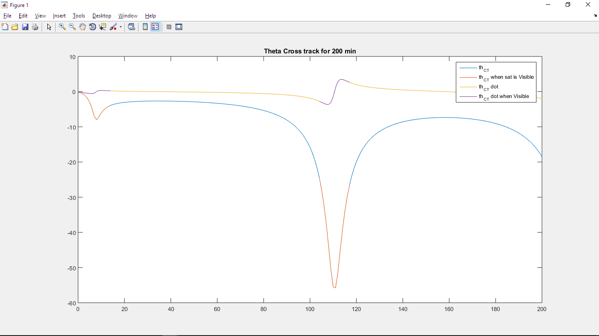
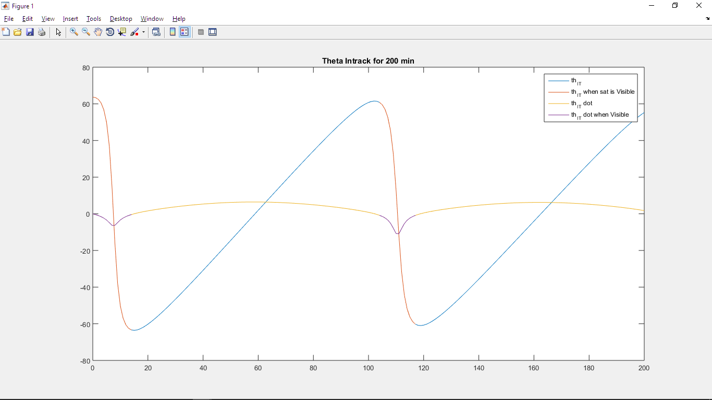

# Tracking-Landmark-from-Satellite
[Spacecraft Dynamics|AA404] : Find and plot the intrack and crosstrack angle commands given to communicating antenna on a satellite, while tracking a ground landmark

#### Youtube video:  

Crosstrack angle (THct) and Crosstrack angle velocity (THct dot):

Intrack angle (THit) and Intrack angle velocity (THit dot):

